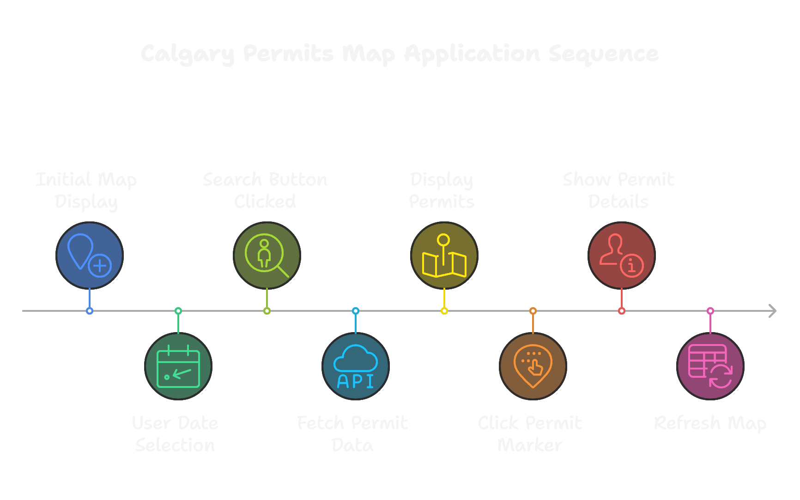

# ENGO651 - Lab 3 Assignment: Calgary Permits Map

## Overview

This project is a geoweb application built using Leaflet.js that visualizes Calgary's building permits data. It integrates the City of Calgary’s Open Data API to fetch building permit information as GeoJSON and displays the data on an interactive map. Users can search for permits by specifying a date range and view detailed permit information by clicking on the markers.

## Project Visual Walkthrough


## Objectives

- Gain experience with Leaflet.js and GeoJSON.
- Develop a geoweb application by integrating multiple APIs.
- Implement interactive features including date range search, marker clustering, and feature identification.
- Address overlapping markers using clustering and visual identification methods.

## Features

- **Initial Map Display:**\
  On page load, the map shows two custom markers using distinct icons: one for Calgary Center and one for the Engineering Block D at the University of Calgary.

- **Date Range Search:**\
  Users can specify a start and end date using date picker inputs. When the “Search” button is clicked, the app fetches and displays only the permit markers that fall within the selected date range, removing the initial markers.

- **Permit Details & Identify Feature:**\
  Clicking on a permit marker opens a popup with detailed information (issued date, work class group, contractor name, community name, and original address). Additionally, a red circle marker highlights the selected permit location.

- **Marker Clustering & Overlap Management:**\
  The application uses the [Leaflet.markercluster](https://github.com/Leaflet/Leaflet.markercluster) plugin to handle overlapping markers and to improve map readability at various zoom levels. This ensures that when multiple permits are located at or near the same location, they are grouped together and can be "spiderfied" for easier selection.

- **Map Refresh on New Search:**\
  When a new date range search is performed, the map refreshes to remove previous permit markers and display the new set of matching results.

## Technologies Used

- **Leaflet.js:** For interactive mapping.
- **Leaflet.markercluster:** For clustering overlapping markers.
- **City of Calgary Open Data API:** To fetch building permit data in GeoJSON format.
- **HTML, CSS, and JavaScript:** For building the web application.

## Installation and Running the Application

1. **Clone the Repository:**

   ```bash
   git clone https://github.com/yourusername/ENGO551-Lab3.git
   cd ENGO651-Lab3
   ```

2. **Configure the API Token:** Create a `config.js` file in the project root with your Open Calgary API token:

   ```js
   window.APP_TOKEN = "YOUR_API_TOKEN_HERE";
   ```

3. **Open the Application:** Open the `index.html` file in your preferred web browser. The map should load with the Calgary Center and Engineering Block D markers displayed.

4. **Using the App:**

   - Use the date picker inputs to select a start and end date.
   - Click the "Search" button to fetch and display building permits within the specified date range.
   - Click on any permit marker to view detailed information.

## Credits and References

- **Leaflet.js Documentation:** [https://leafletjs.com/](https://leafletjs.com/)
- **Leaflet.markercluster Plugin:** [https://github.com/Leaflet/Leaflet.markercluster](https://github.com/Leaflet/Leaflet.markercluster)
- **City of Calgary Open Data API:** [https://data.calgary.ca/](https://data.calgary.ca/)
- **OverlappingMarkerSpiderfier-Leaflet:** [https://github.com/jawj/OverlappingMarkerSpiderfier-Leaflet](https://github.com/jawj/OverlappingMarkerSpiderfier-Leaflet) (optional alternative for handling overlapping markers)

## License

This project is for academic purposes as part of the ENGO651 – Lab 3 Assignment.

